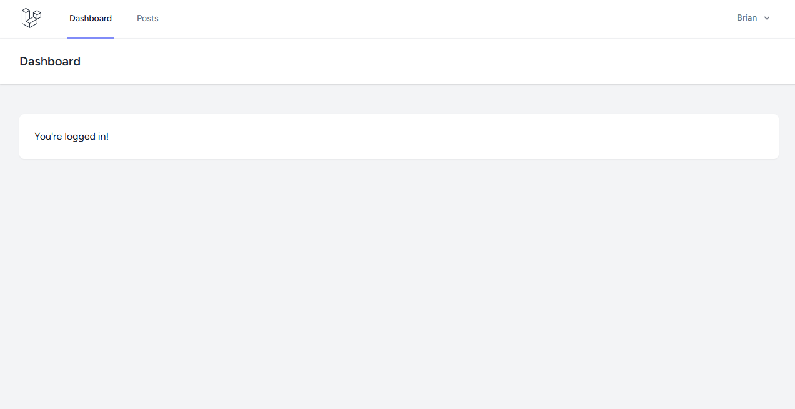

# Exercise Laravel 11 React Inertia.js
Simple CRUD website by combining Laravel 11, React, and Inertia Frameworks.


## Prerequisite:

- Composer >= 2.8
- PHP >= 8.3
- Node >= 22


## Features

- Authentication: register & login
- Update & Delete Account
- CRUD Post


## Screenshots




## Run Locally

Clone the project

```bash
git clone https://github.com/brianajiks123/Simple-CRUD-Post-Laravel11-React-Inertia.git
```

Go to the project directory

```bash
cd Simple-CRUD-Post-Laravel11-React-Inertia
```

Install Dependencies (Laravel)

```bash
composer install
```

Install Dependencies (Node)

```bash
npm install
```

Migrate Database (make sure already setup your environment in the .env file)

```bash
php artisan migrate
```

Running Runtime

```bash
npm run dev
```

Running Development

```bash
php artisan serve
```


## Tech Stack

**Client:** HTML, CSS (Tailwind), JavaScript (React & Inertia), Chrome

**Server:** Laravel 11, Breeze, MySQL, Git, Apache Web Server, VS Code, Windows 11


## Acknowledgements

 - [Laravel](https://laravel.com/docs/11.x)


## Authors

- [@brianajiks123](https://www.github.com/brianajiks123)
